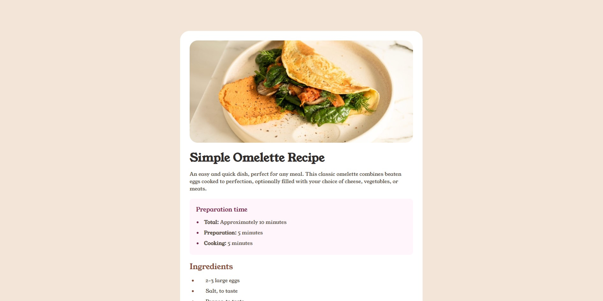
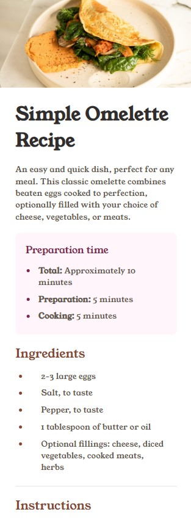

# Frontend Mentor - Recipe page solution

This is a solution to the [Recipe page challenge on Frontend Mentor](https://www.frontendmentor.io/challenges/recipe-page-KiTsR8QQKm). Frontend Mentor challenges help you improve your coding skills by building realistic projects. 

## Table of contents

- [Overview](#overview)
  - [Screenshot](#screenshot)
  - [Links](#links)
- [My process](#my-process)
  - [Built with](#built-with)
  - [What I learned](#what-i-learned)
  - [Continued development](#continued-development)

## Overview

### Screenshot

Desktop View

Mobile View

### Links

- Solution URL: [GitGub page](https://github.com/AgnerShimokawa/recipe-page)
- Live Site URL: [Live site](https://agnershimokawa.github.io/recipe-page/)

## My process

### Built with

- Semantic HTML5 markup
- CSS custom properties

### What I learned

This challenge help me improve some of the more basic HTML and CSS skills. Also it helped me learn a little bit more about organizing the code, making it easier to read and maintain.own learnings.**

### Continued development

I will do more basic challenges so that I can solidify the knowledge for HTML and CSS before taking some of the more difficult ones. This way I'll know what are the things that I have difficulty with, and can improve a little bit more consistently.

## Author

- Website - [Agner Shimokawa](https://github.com/AgnerShimokawa)
- Frontend Mentor - [@AgnerShimokawa](https://www.frontendmentor.io/profile/AgnerShimokawa)
- LinkedIn - [Agner Shimokawa](https://www.linkedin.com/in/agner-shimokawa/)